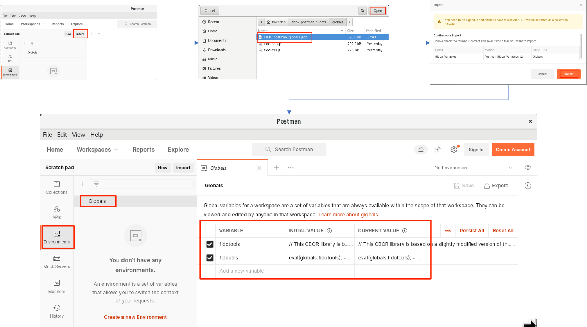
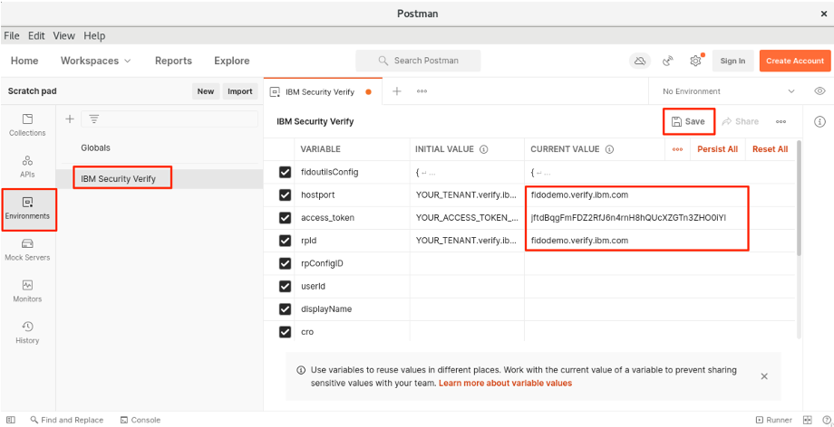
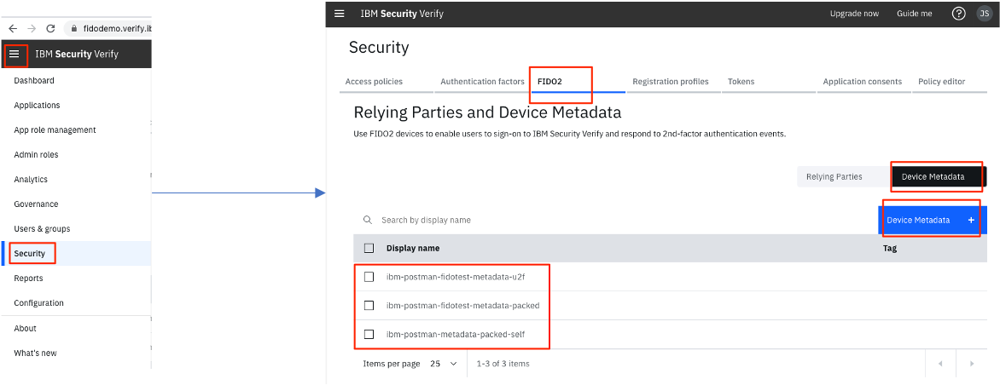
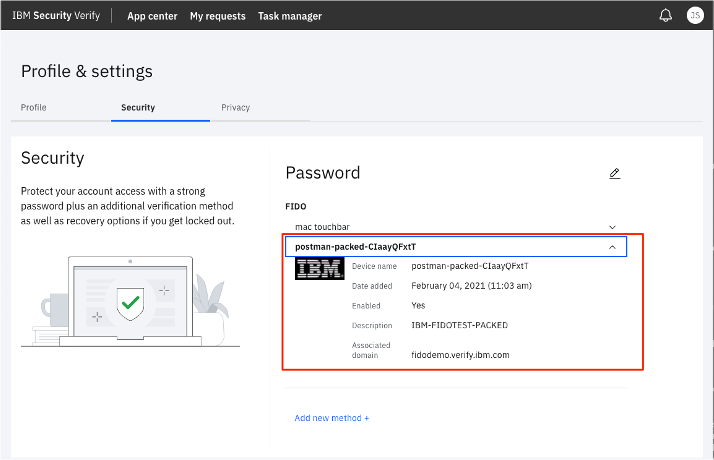
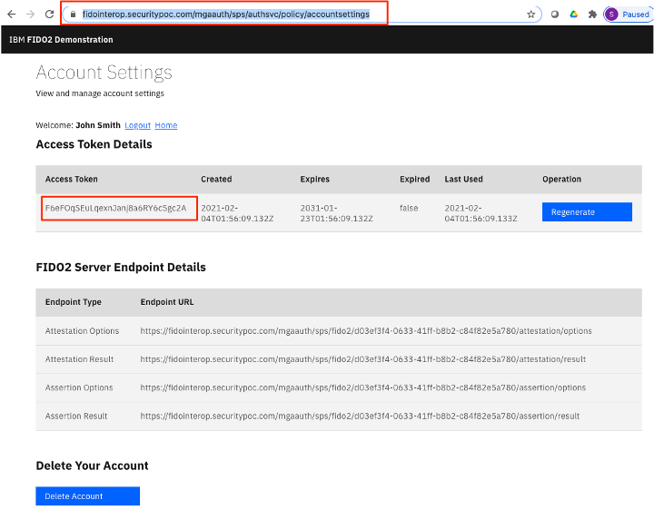
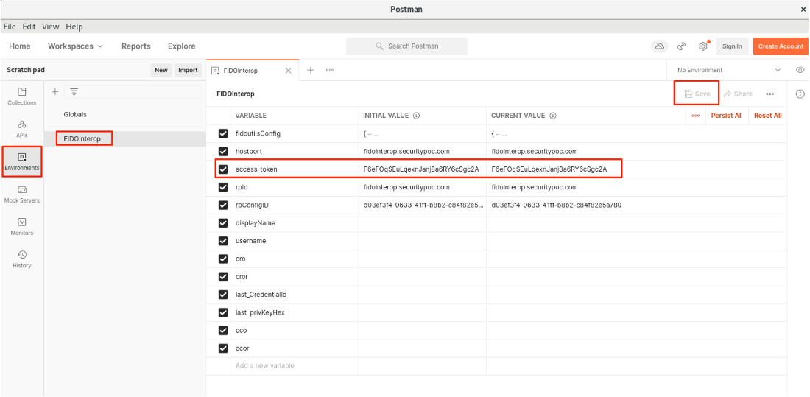
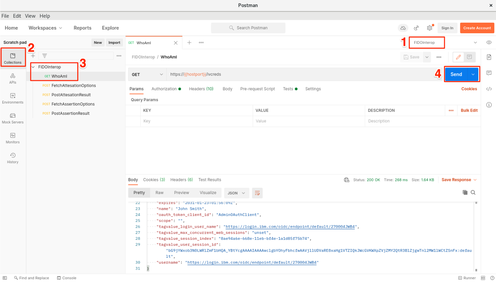
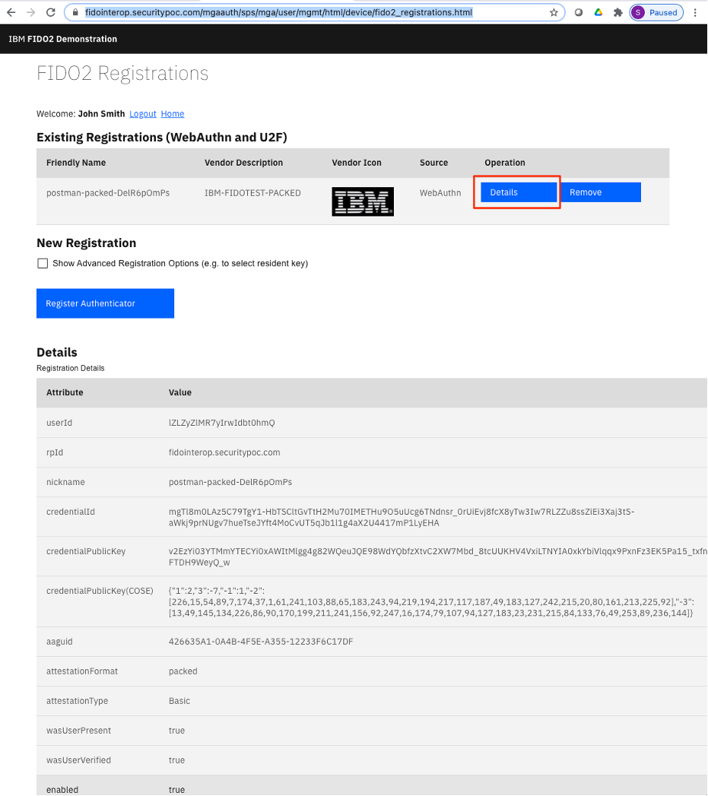

# fido2-postman-clients

This is a free, basic set of [POSTMAN](https://www.postman.com/) assets that demonstrate in Javascript how to build the data structures used for FIDO2 registration (aka attestation) and login (aka assertion) ceremonies described in the [WebAuthn specification](https://www.w3.org/TR/webauthn/), and how to interact with either an [IBM Security Verify SaaS](https://docs.verify.ibm.com/) service for FIDO2 operations, or a [demonstration site](https://fidointerop.securitypoc.com) I manage for testing FIDO2 operations that is built using [IBM Security Verify Access](https://www.ibm.com/support/knowledgecenter/SSPREK/welcome.html). It would be trivial to modify the collection to test against other server implementations.

The assets make use of several other open source libraries for crypto and data encoding/decoding functions, and those libraries and their associated licenses are embedded in the source code files (in particular see `globals/fidotools.js`) in this repository so that everything you need to use the collection can be found in one place. I'd like to acknowledge and thank the authors of those libraries, as without them building this asset would have been much more work. These libraries are:

- [cbor-js](https://github.com/paroga/cbor-js) (with a minor update to decode variable-length fields)
- [crypto-js](https://code.google.com/p/crypto-js)
- [KJUR / jsrsasign and its dependencies](https://kjur.github.io/jsrsasign/)
 

The example software-based authenticator built into this POSTMAN collection supports only `EC256 keypairs`, and it is possible to demonstrate `fido-u2f`, `packed`, and `self` attestation formats although because this is a software-based attestation with private keys included in the source you cannot really ever trust it. There is no attempt in the client code in POSTMAN to honour or validate the server options for attestation and assertion regarding permitted algorithms, rpId, user verification, etc. Please keep in mind that this is not a full-blooded client. The goal of this collection is to demonstrate how to construct well-formed attestation and assertion payloads and to test the happy path against a server implementation. It should be a useful starting point for anyone writing their own thick client or native mobile application to understand how to construct FIDO2 messages.

Clone the repository to you local file system to follow the instructions below for use.

## Using the POSTMAN collections

As mentioned earlier, the POSTMAN collection can be demonstrated against either an [IBM Security Verify SaaS](https://docs.verify.ibm.com/) tenant or the [hosted testing site](https://fidointerop.securitypoc.com) (not guaranteed to be always running!) built on top of IBM Security Verify Access. This section will take you through the configuration and usage of POSTMAN for each of these scenarios.

### Common globals setup

This section is applicable regardless of whether or not you intend to use the API collection for [IBM Security Verify SaaS](https://docs.verify.ibm.com/), or the collection for the [demonstration site](https://fidointerop.securitypoc.com) built on [IBM Security Verify Access](https://www.ibm.com/support/knowledgecenter/SSPREK/welcome.html).


Install [POSTMAN](https://www.postman.com/) (I used version 8.0.3 in preparing this documentation).

Import two global variables that contain Javascript helper functions called from within the POSTMAN collections. This respository contains both the original JS files for you to peruse, and a pre-bundled copy of them within a single importable JSON file that POSTMAN can ingest in one go. 

From the the main POSTMAN window, click Import, then select and import the `globals/FIDO.postman_globals.json` file from this repository as shown here:



For later reference, the `fidotools` global contains a copy of the contents of the `globals/fidotools.js` file from this repository and the `fidoutils` global contains a copy of the contents of the `globals/fidoutils.js` file from this repository. The differentiation between these files is as follows:

 - `fidotools` contains 3rd-party open source libraries used in this collection, along with their license information and where I originally retrieved them from. 
 - `fidoutils` contains code that I have written on top of the utilities from `fidotools`. These functions demonstrate how to construct FIDO data structures and include generation and use of EC256 keypairs for FIDO attestation and assertion ceremonies. Functions within fidoutils are the primary feature of this asset, and are called from Pre-request and Tests scripts in the POSTMAN collections.

### Using the IBM Security Verify collection

This section will demonstrate how to use the FIDO2 API collection against an IBM Security Verify SaaS tenant. 

If you do not already have an IBM Security Verify tenant, you can find [instructions to obtain a free trial here](https://docs.verify.ibm.com/verify/docs/signing-up-for-a-free-trial). Make sure you can login to your tenant, and for the purposes of this exercise navigate starting from the Application Launchpad (not the admin view) to the user's **Profiles &amp; settings -> Security** page (typically the URL for this page is of the form):

```
https://<your_tenant>.verify.ibm.com/usc/settings/security
```

For the purposes of this document, I am going to use the tenant: **fidodemo.verify.ibm.com**

Next we are going to "lift" an access token from the browser for your user. This will be used in the POSTMAN environment to make API calls as your user. There are many other ways to legitimately [obtain a user access token](https://docs.verify.ibm.com/verify/docs/acquire-an-access-token) in IBM Security Verify, but for the purposes of this walk-through, this quick-and-dirty approach works fine. If you are obtaining an access token via another method, be sure you are getting an access token for a **user**, and not one for an administrative API Client. For example you could be using the `OAuth 2.0 ROPC` flow, or the `OpenID Connect Authorization Code` flow, however you would not be using the `OAuth 2.0 Client Credentials` flow.

In the browser when displaying the security settings page, open the Network inspector in developer tools and refresh the page. Pick one of the fetch-based APIs that is called when loading this page, look at the Request Headers, and extract the access token that is being used in the Authorization header. In my example below this access token value is `jftdBqgFmFDZ2RfJ6n4rnH8hQUcXZGTn3ZHO0iYl`. This will be used in the next steps.


Next, install the POSTMAN environment and collection files for IBM Security Verify. These can be imported in an identical manner to the globals. Find the files at:

 - `isv/IBM_Security_Verify.postman_environment.json`
 - `isv/IBM_Security_Verify.postman_collection.json`

Next update the starting environment variables to match your tenant and user. See the diagram below for how to perform the edit.

The following variables should be updated:

 - `hostport` - change the value to match your tenant hostname
 - `access_token` - change the value to an access token for your user on your tenant as extracted above
 - `rpId` - change the value to match your tenant hostname

Don't forget to save your changes!



Set the current environment to `IBM Security Verify` (top right of POSTMAN window), and then open the `WhoAmI` API in the collection and perform a request using the `Send` button:


You should see a 200 OK successful response with user information in the response body.

You can now exercise each API in the order shown in the collection from top to bottom. Study the `Pre-request` and `Tests` scripts (where they are present in APIs to see how calls are made to the functions declared in the `fidoutils` global. Once a credential is successfully created with the `PostAttestationResult` API, there is no need to run the `FetchAttestationOptions`/`PostAttestationResult` APIs again - you can just run the `FetchAssertionoptions`/`PostAssertionResult` pair as many times as you like.

If an API fails, the most likely reason is an expired access token. To fix this, login to the IBM Security Verify SaaS portal and re-retrieve an access token and update your environment variable as described earlier in this section.

Each API and a brief description of it's purpose is as follows:

- `WhoAmI` - uses the access token to retrieve information on the current user. After execution the `Tests` script, populates the `userId` and `displayName` variables, used as input to the `FetchAttestationOptions` API.

- `DiscoverRelyingPartyConfigID` - Retrieves a discovery endpoint to figure out the UUID part of the URL path that is used for the endpoints to the FIDO2 APIs for attestation and assertion for this particular relying party (identified by `rpId` for your tenant). After execution the `Tests` script populates the `rpConfigID` variable with this value.

- `FetchAttestationOptions` - Retrieves a challenge and server options to being an attestation ceremony. After execution the `Tests` script populates a variable `cco` with [CredentialCreationOptions](https://www.w3.org/TR/webauthn/#sctn-credentialcreationoptions-extension).

- `PostAttestationResult` - Builds and sends a valid attestation response based on the previously retrieved `cco`. The `Pre-request` establishes a valid origin URL, calls a `fidoutils` API to generate a key pair and attestation statement and generates a nickname for the attestation response. The default attestation format is `packed`. You can experiment with other attestaion formats by changing the `attestationFormat` variable in the `Pre-request` script (see embedded comments). After execution, the `Tests` script performs a very basic validation on the expected response. What is noteworthy (and really just a demo, not a production-strength implementation) in this demonstration is that the private key of the generated keypair is symmetrically encrypted and this encrypted value becomes the `Credential ID` of the credential submitted to the server.

- `FetchAssertionOptions` - Retrieves a challenge and server options to being an assertion ceremony. After execution the `Tests` script populates a variable `cro` with [CredentialRequestOptions](https://www.w3.org/TR/webauthn/#sctn-credentialrequestoptions-extension).

- `PostAssertionResult` - Builds and sends a valid assertion response based on the previously retrieved `cro`. The `Pre-request` establishes a valid origin URL and calls a `fidoutils` API to generate the signed response. The way the private key for signing is "discovered" is by iterating over the `allowedCredentials` array in the assertion options trying to symmetrically decrypt the credential ids. The **first** credential from ths array that can be decrypted is used for signing the assertion (see implementation of `processCredentialRequestOptions` in `fidoutils` for more details.

#### Optional: Installing and using the metadata

The `metadata` subdirectory in this repository contains FIDO metadata statements that can be installed on the server for verifying the attestation statements. You can configure them into the IBM Security Verify FIDO2 relying party definition using the administration console as shown:



#### Viewing created credentials in the user self care portal

From the Application Launchpad view in the IBM Security Verify portal, navigate back to your user's  **Profiles &amp; settings -> Security** page. You should now see the credential registered from POSTMAN, and if metadata has been uploaded you can expand the registration and see the description and icon from the matching metadata file:



### Using the IBM Security Verify Access collection against the fidointerop demonstration site

This section will demonstrate how to use the FIDO2 API collection against a [demonstration site](https://fidointerop.securitypoc.com) I manage for testing FIDO2 operations that is built using [IBM Security Verify Access](https://www.ibm.com/support/knowledgecenter/SSPREK/welcome.html).

Many of the instructions are similar to those for IBM Security Verify SaaS - the main difference is in how you obtain your access token, and the fact that the API endpoints are statically defined because the hosted demonstration site has an establised configuration. There is also a slight difference in how user information is shared with the server in the API calls themselves.

First let's get your access token. This can be retrieved from the demonstration site itself, in the [Account Settings](https://fidointerop.securitypoc.com/mgaauth/sps/authsvc/policy/accountsettings) page. Access this page, login if needed, and retrieve your access token. You will need an IBM ID to login to this site - this can be easily self-created if you do not already have one. In the example below my access token is: `F6eFOqSEuLqexnJanj8a6RY6cSgc2A`.




Next, install the POSTMAN environment and collection files for IBM Security Verify Acess. These can be imported in an identical manner to the globals. Find the files at:

 - `isva-fidointerop/FIDOInterop.postman_environment.json`
 - `isva-fidointerop/FIDOInterop.postman_collection.json`

Next update the `access_token` environment variable to match your user. See the diagram below for how to perform the edit. This should be the only required edit although you can eyeball the remaining variables to confirm their values.



Don't forget to save your changes!

Set the current environment to `FIDOInterop` (top right of POSTMAN window), and then open the `WhoAmI` API in the collection and perform a request using the `Send` button:



You should see a 200 OK successful response with user information in the response body.

You can now exercise each API in the order shown in the collection from top to bottom. Study the `Pre-request` and `Tests` scripts (where they are present in APIs to see how calls are made to the functions declared in the `fidoutils` global. Once a credential is successfully created with the `PostAttestationResult` API, there is no need to run the `FetchAttestationOptions`/`PostAttestationResult` APIs again - you can just run the `FetchAssertionoptions`/`PostAssertionResult` pair as many times as you like.

Each API has the same general purpose and description as those shown earlier for IBM Security Verfy SaaS. Please read those descriptions for a detailed explanation of what each API does.

#### Viewing created credentials in the demonstration site

The [FIDO2 Registrations](https://fidointerop.securitypoc.com/mgaauth/sps/mga/user/mgmt/html/device/fido2_registrations.html) page of the demonstration site can be used to view FIDO2 registered credentials. You should now see the credential registered from POSTMAN. As I have already uploaded metadata to the demonstration site, you should noticed that the registration includes a description and icon from the matching metadata file:



By pressing the `Details` button, you can see expanded details of the registration, including the COSE format of the credential public key. As an exercise, try using the POSTMAN console to capture an assertion flow, and verify the message payload using the COSE public key using the [FIDO2 Viewer](https://github.com/sbweeden/fido2viewer) utility that I have also open-sourced. 